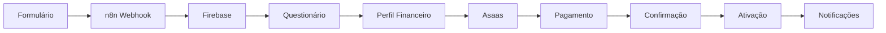

# 🚀 Guia Rápido - Integração n8n Alfredo

## ⚡ **Setup Rápido (5 minutos)**

### **1. Instalar e Configurar n8n**

```bash
# Instalar n8n globalmente
npm run n8n:install

# Configurar automaticamente
npm run n8n:setup

# Iniciar n8n
npm run n8n:start
```

### **2. Configurar Variáveis de Ambiente**

Edite o arquivo `.env.n8n` criado:

```bash
# Firebase
FIREBASE_API_KEY=sua_chave_firebase
FIREBASE_ID_TOKEN=seu_token_firebase

# Asaas
ASAAS_API_KEY=sua_chave_asaas

# WhatsApp
WHATSAPP_ACCESS_TOKEN=seu_token_whatsapp
WHATSAPP_PHONE_NUMBER_ID=seu_phone_id

# SendGrid
SENDGRID_API_KEY=sua_chave_sendgrid
```

### **3. Importar Workflows**

1. Acesse `http://localhost:5678`
2. Vá em **Workflows** > **Import from File**
3. Importe os arquivos da pasta `workflows/`:
   - `alfredo-user-creation.json`
   - `alfredo-payment-confirmation.json`
4. Ative os workflows

### **4. Configurar Webhooks do Asaas**

No painel do Asaas, configure o webhook:
- **URL**: `https://seu-n8n.com/webhook/alfredo-payment-confirmation`
- **Eventos**: `PAYMENT_RECEIVED`

## 🔄 **Fluxo Completo**

### **Sequência de Execução**



### **Webhooks Disponíveis**

| Endpoint | Descrição | Método |
|----------|-----------|--------|
| `/webhook/alfredo-user-creation` | Criação de usuário | POST |
| `/webhook/alfredo-financial-questionnaire` | Questionário financeiro | POST |
| `/webhook/alfredo-plan-selection` | Seleção de plano | POST |
| `/webhook/alfredo-payment-confirmation` | Confirmação pagamento | POST |

## 🧪 **Teste Rápido**

### **1. Teste de Criação de Usuário**

```bash
curl -X POST http://localhost:5678/webhook/alfredo-user-creation \
  -H "Content-Type: application/json" \
  -d '{
    "name": "João Silva",
    "email": "joao@teste.com",
    "phone": "(11) 99999-9999",
    "password": "123456"
  }'
```

### **2. Teste de Questionário**

```bash
curl -X POST http://localhost:5678/webhook/alfredo-financial-questionnaire \
  -H "Content-Type: application/json" \
  -d '{
    "userId": "user123",
    "salary": "5000",
    "housingExpense": "1500",
    "transportationExpense": "500",
    "foodExpense": "800",
    "healthExpense": "300",
    "educationExpense": "200",
    "entertainmentExpense": "400",
    "savingsGoal": "1000",
    "financialGoal": "save",
    "experienceLevel": "beginner"
  }'
```

## 🔧 **Integração no Frontend**

### **1. Adicionar Variável de Ambiente**

```bash
# .env
VITE_N8N_BASE_URL=http://localhost:5678
```

### **2. Usar o Serviço**

```typescript
import { n8nService } from '@/integrations/n8n/webhookService';

// Criar usuário
const result = await n8nService.createUser({
  name: 'João Silva',
  email: 'joao@teste.com',
  phone: '(11) 99999-9999',
  password: '123456'
});

// Enviar questionário
await n8nService.submitFinancialQuestionnaire({
  userId: result.userId,
  salary: '5000',
  // ... outros dados
});

// Selecionar plano
const payment = await n8nService.selectPlan({
  userId: result.userId,
  name: 'João Silva',
  email: 'joao@teste.com',
  phone: '(11) 99999-9999',
  plan: 'premium'
});
```

## 📊 **Monitoramento**

### **1. Logs do n8n**

Acesse `http://localhost:5678` e vá em:
- **Executions** - Ver execuções
- **Workflows** - Ver workflows ativos
- **Settings** - Configurações

### **2. Métricas Importantes**

- ✅ **Taxa de conversão** de criação de usuário
- ✅ **Tempo médio** de processamento
- ✅ **Taxa de erro** nos webhooks
- ✅ **Status dos pagamentos**

## 🚨 **Troubleshooting**

### **Problemas Comuns**

| Problema | Solução |
|----------|---------|
| n8n não inicia | Verificar porta 5678 disponível |
| Webhook não responde | Verificar se workflow está ativo |
| Erro de autenticação | Verificar variáveis de ambiente |
| Pagamento não confirma | Verificar webhook do Asaas |

### **Logs de Debug**

```bash
# Ver logs do n8n
n8n start --debug

# Testar conectividade
curl http://localhost:5678/healthz
```

## 🎯 **Próximos Passos**

1. **Configurar produção** - Deploy do n8n
2. **Adicionar retry logic** - Para falhas
3. **Implementar analytics** - Métricas avançadas
4. **Criar dashboard** - Monitoramento visual
5. **Adicionar testes** - Automação de testes

## 📞 **Suporte**

- 📧 **Email**: suporte@alfredo.com.br
- 📱 **WhatsApp**: (11) 99999-9999
- 📖 **Documentação**: `/docs/INTEGRACAO_N8N_COMPLETA.md`

---

**Status**: ✅ Pronto para Produção  
**Tempo de Setup**: 5 minutos  
**Última Atualização**: Janeiro 2025
