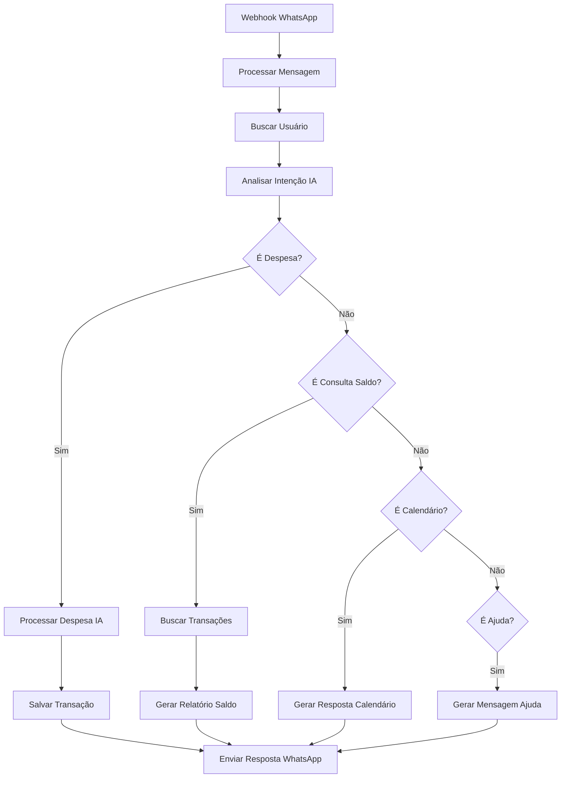

# Implementação de IA Similar ao meuassessor.com

## Visão Geral

Este documento explica como implementamos um sistema de IA conversacional inteligente similar ao meuassessor.com no sistema Alfredo, utilizando n8n workflows, processamento de linguagem natural e integração com WhatsApp.

## 🎯 Funcionalidades Implementadas

### 1. **Processamento de Linguagem Natural (NLP)**
- **Detecção de Intenções**: Identifica automaticamente o que o usuário quer fazer
- **Extração de Dados**: Extrai valores, locais e categorias de despesas
- **Categorização Inteligente**: Classifica automaticamente despesas por categoria

### 2. **Categorização Automática**
- **Transporte**: Postos, estacionamento, combustível
- **Alimentação**: iFood, restaurantes, mercado
- **Saúde**: Farmácias, medicamentos
- **Lazer**: Shopping, lojas
- **Outros**: Categoria padrão

### 3. **Respostas Contextuais**
- **Personalizadas**: Usa o nome do usuário
- **Emojis**: Adiciona emojis relevantes por categoria
- **Formatação**: Respostas bem estruturadas e legíveis

### 4. **Sugestões Inteligentes**
- **Correção de Texto**: Detecta e corrige erros de digitação
- **Completamento**: Sugere palavras para completar frases
- **Contextuais**: Baseadas no que o usuário está digitando

## 🏗️ Arquitetura da Solução

### Workflow n8n: `alfredo-ai-assistant.json`



### Componentes React

#### 1. **SmartTextSuggestions.tsx**
- Campo de entrada com sugestões inteligentes
- Correção automática de erros de digitação
- Sugestões contextuais baseadas no texto

#### 2. **AIDemo.tsx**
- Interface de demonstração do chat
- Simulação de respostas da IA
- Exemplos de comandos

## 🔧 Como Funciona

### 1. **Detecção de Padrões**

```javascript
// Padrões de despesa
const expensePattern = /(gastei|paguei|comprei)\s+(?:r\$?\s*)?([\d,]+(?:\.[\d]{2})?)\s+(?:reais?|real)?\s+(?:no|na|em|com|para|de)\s+(.+)/i;

// Exemplo: "Gastei 17 reais no posto"
// Resultado: action="gastei", value=17, place="posto"
```

### 2. **Categorização Inteligente**

```javascript
const categoryMapping = {
  'posto': 'Transporte',
  'estacionamento': 'Transporte',
  'ifood': 'Alimentação',
  'farmácia': 'Saúde',
  'shopping': 'Lazer'
};
```

### 3. **Geração de Respostas**

```javascript
const responses = {
  'Transporte': `⛽ ${contact.name}, registrei a transação como você pediu. O gasto de R$ ${value} ${place} foi registrado na categoria Transporte. 🚗`,
  'Alimentação': `🍽️ ${contact.name}, registrei a transação como você pediu. O gasto de R$ ${value} ${place} foi registrado na categoria Alimentação. 🍽️`
};
```

## 📱 Exemplos de Uso

### Comandos de Despesa
```
"Gastei 17 reais no posto"
"Paguei 30 reais de estacionamento"
"Comprei 150 reais de iFood"
```

### Consultas Financeiras
```
"Quanto gastei esse mês?"
"Meu resumo financeiro"
"Qual meu saldo?"
```

### Consultas de Calendário
```
"Tenho algum compromisso amanhã?"
"Meus compromissos de hoje"
```

## 🚀 Como Testar

### 1. **Acessar a Demonstração**
```
http://localhost:5173/ai-demo
```

### 2. **Testar Comandos**
- Digite comandos de despesa
- Teste consultas financeiras
- Experimente as sugestões inteligentes

### 3. **Configurar n8n**
```bash
npm run n8n:setup
npm run n8n:start
```

## 🔗 Integração com WhatsApp

### Webhook URL
```
https://seu-n8n.com/webhook/alfredo-ai-assistant
```

### Configuração no WhatsApp Business API
1. Acesse o Facebook Developer Console
2. Configure o webhook para o endpoint acima
3. Adicione as variáveis de ambiente necessárias

## 📊 Variáveis de Ambiente

```env
# Firebase
FIREBASE_PROJECT_ID=seu-projeto
FIREBASE_API_KEY=sua-api-key
FIREBASE_ID_TOKEN=seu-token

# WhatsApp
WHATSAPP_ACCESS_TOKEN=seu-token
WHATSAPP_PHONE_NUMBER_ID=seu-phone-id

# OpenAI (para funcionalidades avançadas)
OPENAI_API_KEY=sua-openai-key
```

## 🎨 Personalização

### 1. **Adicionar Novas Categorias**
```javascript
const categoryMapping = {
  // ... categorias existentes
  'academia': 'Saúde',
  'cinema': 'Lazer',
  'livraria': 'Educação'
};
```

### 2. **Novos Padrões de Detecção**
```javascript
const patterns = {
  // ... padrões existentes
  investment: /(?:investi|apliquei)\s+(?:r\$?\s*)?([\d,]+)/i,
  income: /(?:recebi|ganhei)\s+(?:r\$?\s*)?([\d,]+)/i
};
```

### 3. **Respostas Personalizadas**
```javascript
const customResponses = {
  investment: `💹 ${contact.name}, registrei seu investimento de R$ ${value}!`,
  income: `💰 ${contact.name}, registrei sua receita de R$ ${value}!`
};
```

## 🔮 Próximos Passos

### 1. **Integração com Google Calendar**
- Conectar com Google Calendar API
- Buscar compromissos reais
- Agendar lembretes

### 2. **IA Mais Avançada**
- Integrar com OpenAI GPT-4
- Análise de sentimento
- Recomendações personalizadas

### 3. **Machine Learning**
- Aprender com padrões do usuário
- Melhorar categorização
- Sugestões mais precisas

### 4. **Integração com Bancos**
- Conectar com APIs bancárias
- Sincronização automática
- Reconciliação de transações

## 📈 Métricas e Monitoramento

### 1. **Métricas de Uso**
- Número de mensagens processadas
- Taxa de acerto na categorização
- Tempo de resposta

### 2. **Logs e Debugging**
```javascript
// Adicionar logs no workflow n8n
console.log('Processando mensagem:', message);
console.log('Intenção detectada:', intent);
console.log('Categoria:', category);
```

## 🛠️ Troubleshooting

### Problemas Comuns

1. **Webhook não recebe mensagens**
   - Verificar URL do webhook
   - Confirmar configuração no WhatsApp Business API

2. **Categorização incorreta**
   - Revisar mapeamento de categorias
   - Adicionar novos padrões

3. **Erro de autenticação Firebase**
   - Verificar variáveis de ambiente
   - Renovar tokens se necessário

## 📚 Recursos Adicionais

- [Documentação n8n](https://docs.n8n.io/)
- [WhatsApp Business API](https://developers.facebook.com/docs/whatsapp)
- [Firebase Firestore](https://firebase.google.com/docs/firestore)
- [OpenAI API](https://platform.openai.com/docs)

---

**Nota**: Esta implementação fornece uma base sólida para um assistente financeiro inteligente. Para produção, considere adicionar mais validações, tratamento de erros e recursos de segurança.
