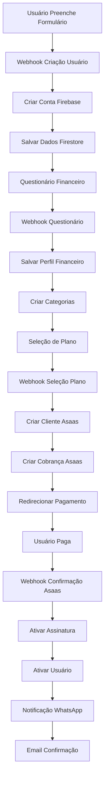

# 🔄 Integração Completa n8n - Alfredo

## 📋 **Visão Geral**

Este documento explica como integrar todo o processo de onboarding do Alfredo no n8n, criando automações que conectam desde a criação do usuário até a ativação da assinatura.

## 🏗️ **Arquitetura da Integração**

### **Fluxos Principais**

1. **Webhook de Criação de Usuário** - Captura dados do formulário
2. **Processamento de Questionário** - Salva perfil financeiro
3. **Integração com Asaas** - Cria cliente e cobrança
4. **Webhook de Pagamento** - Confirma pagamento
5. **Ativação de Assinatura** - Ativa conta do usuário
6. **Notificações** - WhatsApp e email

## 🔧 **Configuração dos Webhooks**

### **1. Webhook de Criação de Usuário**

```json
{
  "name": "Alfredo - Criação de Usuário",
  "nodes": [
    {
      "name": "Webhook - Criação Usuário",
      "type": "n8n-nodes-base.webhook",
      "parameters": {
        "httpMethod": "POST",
        "path": "alfredo-user-creation",
        "responseMode": "responseNode"
      }
    },
    {
      "name": "Validar Dados",
      "type": "n8n-nodes-base.code",
      "parameters": {
        "jsCode": `
          const { name, email, phone, password } = $input.first().json;
          
          // Validações
          if (!name || !email || !phone || !password) {
            throw new Error('Dados obrigatórios não fornecidos');
          }
          
          if (password.length < 6) {
            throw new Error('Senha deve ter pelo menos 6 caracteres');
          }
          
          return {
            json: {
              name,
              email,
              phone,
              password,
              timestamp: new Date().toISOString(),
              status: 'pending'
            }
          };
        `
      }
    },
    {
      "name": "Criar Usuário Firebase",
      "type": "n8n-nodes-base.httpRequest",
      "parameters": {
        "method": "POST",
        "url": "https://identitytoolkit.googleapis.com/v1/accounts:signUp",
        "authentication": "genericCredentialType",
        "genericAuthType": "httpHeaderAuth",
        "sendHeaders": true,
        "headerParameters": {
          "parameters": [
            {
              "name": "Content-Type",
              "value": "application/json"
            }
          ]
        },
        "sendBody": true,
        "bodyParameters": {
          "parameters": [
            {
              "name": "email",
              "value": "={{ $json.email }}"
            },
            {
              "name": "password",
              "value": "={{ $json.password }}"
            },
            {
              "name": "returnSecureToken",
              "value": "true"
            }
          ]
        }
      }
    },
    {
      "name": "Salvar Dados Firestore",
      "type": "n8n-nodes-base.httpRequest",
      "parameters": {
        "method": "POST",
        "url": "https://firestore.googleapis.com/v1/projects/alfredo-app/databases/(default)/documents/users",
        "authentication": "genericCredentialType",
        "genericAuthType": "httpHeaderAuth",
        "sendHeaders": true,
        "headerParameters": {
          "parameters": [
            {
              "name": "Content-Type",
              "value": "application/json"
            }
          ]
        },
        "sendBody": true,
        "bodyParameters": {
          "parameters": [
            {
              "name": "fields",
              "value": "={{ { name: { stringValue: $json.name }, email: { stringValue: $json.email }, phone: { stringValue: $json.phone }, createdAt: { timestampValue: new Date().toISOString() }, status: { stringValue: 'pending' } } } }}"
            }
          ]
        }
      }
    },
    {
      "name": "Resposta Sucesso",
      "type": "n8n-nodes-base.respondToWebhook",
      "parameters": {
        "respondWith": "json",
        "responseBody": "={{ { success: true, message: 'Usuário criado com sucesso', userId: $json.localId } }}"
      }
    }
  ]
}
```

### **2. Webhook de Questionário Financeiro**

```json
{
  "name": "Alfredo - Questionário Financeiro",
  "nodes": [
    {
      "name": "Webhook - Questionário",
      "type": "n8n-nodes-base.webhook",
      "parameters": {
        "httpMethod": "POST",
        "path": "alfredo-financial-questionnaire",
        "responseMode": "responseNode"
      }
    },
    {
      "name": "Processar Dados Financeiros",
      "type": "n8n-nodes-base.code",
      "parameters": {
        "jsCode": `
          const data = $input.first().json;
          const userId = data.userId;
          
          // Converter valores monetários
          const salary = parseFloat(data.salary.replace(/[^\d,]/g, '').replace(',', '.'));
          const housingExpense = parseFloat(data.housingExpense.replace(/[^\d,]/g, '').replace(',', '.'));
          const transportationExpense = parseFloat(data.transportationExpense.replace(/[^\d,]/g, '').replace(',', '.'));
          const foodExpense = parseFloat(data.foodExpense.replace(/[^\d,]/g, '').replace(',', '.'));
          const healthExpense = parseFloat(data.healthExpense.replace(/[^\d,]/g, '').replace(',', '.'));
          const educationExpense = parseFloat(data.educationExpense.replace(/[^\d,]/g, '').replace(',', '.'));
          const entertainmentExpense = parseFloat(data.entertainmentExpense.replace(/[^\d,]/g, '').replace(',', '.'));
          const savingsGoal = parseFloat(data.savingsGoal.replace(/[^\d,]/g, '').replace(',', '.'));
          
          // Calcular totais
          const totalExpenses = housingExpense + transportationExpense + foodExpense + healthExpense + educationExpense + entertainmentExpense;
          const availableForSavings = salary - totalExpenses;
          
          return {
            json: {
              userId,
              salary,
              housingExpense,
              transportationExpense,
              foodExpense,
              healthExpense,
              educationExpense,
              entertainmentExpense,
              savingsGoal,
              financialGoal: data.financialGoal,
              experienceLevel: data.experienceLevel,
              totalExpenses,
              availableForSavings,
              createdAt: new Date().toISOString()
            }
          };
        `
      }
    },
    {
      "name": "Salvar Perfil Financeiro",
      "type": "n8n-nodes-base.httpRequest",
      "parameters": {
        "method": "POST",
        "url": "https://firestore.googleapis.com/v1/projects/alfredo-app/databases/(default)/documents/userProfiles",
        "authentication": "genericCredentialType",
        "genericAuthType": "httpHeaderAuth",
        "sendHeaders": true,
        "headerParameters": {
          "parameters": [
            {
              "name": "Content-Type",
              "value": "application/json"
            }
          ]
        },
        "sendBody": true,
        "bodyParameters": {
          "parameters": [
            {
              "name": "fields",
              "value": "={{ { userId: { stringValue: $json.userId }, salary: { doubleValue: $json.salary }, housingExpense: { doubleValue: $json.housingExpense }, transportationExpense: { doubleValue: $json.transportationExpense }, foodExpense: { doubleValue: $json.foodExpense }, healthExpense: { doubleValue: $json.healthExpense }, educationExpense: { doubleValue: $json.educationExpense }, entertainmentExpense: { doubleValue: $json.entertainmentExpense }, savingsGoal: { doubleValue: $json.savingsGoal }, financialGoal: { stringValue: $json.financialGoal }, experienceLevel: { stringValue: $json.experienceLevel }, totalExpenses: { doubleValue: $json.totalExpenses }, availableForSavings: { doubleValue: $json.availableForSavings }, createdAt: { timestampValue: $json.createdAt } } }}"
            }
          ]
        }
      }
    },
    {
      "name": "Criar Categorias Personalizadas",
      "type": "n8n-nodes-base.code",
      "parameters": {
        "jsCode": `
          const data = $input.first().json;
          const userId = data.userId;
          
          // Categorias baseadas nos dados financeiros
          const categories = [
            {
              name: 'Moradia',
              limite: data.housingExpense,
              cor: '#FF6B6B',
              icone: 'home'
            },
            {
              name: 'Transporte',
              limite: data.transportationExpense,
              cor: '#4ECDC4',
              icone: 'car'
            },
            {
              name: 'Alimentação',
              limite: data.foodExpense,
              cor: '#45B7D1',
              icone: 'utensils'
            },
            {
              name: 'Saúde',
              limite: data.healthExpense,
              cor: '#96CEB4',
              icone: 'heart'
            },
            {
              name: 'Educação',
              limite: data.educationExpense,
              cor: '#FFEAA7',
              icone: 'graduation-cap'
            },
            {
              name: 'Lazer',
              limite: data.entertainmentExpense,
              cor: '#DDA0DD',
              icone: 'smile'
            },
            {
              name: 'Economias',
              limite: data.savingsGoal,
              cor: '#98D8C8',
              icone: 'piggy-bank'
            }
          ];
          
          return {
            json: {
              userId,
              categories,
              timestamp: new Date().toISOString()
            }
          };
        `
      }
    },
    {
      "name": "Salvar Categorias",
      "type": "n8n-nodes-base.httpRequest",
      "parameters": {
        "method": "POST",
        "url": "https://firestore.googleapis.com/v1/projects/alfredo-app/databases/(default)/documents/categories",
        "authentication": "genericCredentialType",
        "genericAuthType": "httpHeaderAuth",
        "sendHeaders": true,
        "headerParameters": {
          "parameters": [
            {
              "name": "Content-Type",
              "value": "application/json"
            }
          ]
        },
        "sendBody": true,
        "bodyParameters": {
          "parameters": [
            {
              "name": "fields",
              "value": "={{ { userId: { stringValue: $json.userId }, categories: { arrayValue: { values: $json.categories.map(cat => ({ mapValue: { fields: { name: { stringValue: cat.name }, limite: { doubleValue: cat.limite }, cor: { stringValue: cat.cor }, icone: { stringValue: cat.icone } } } })) } } }, createdAt: { timestampValue: $json.timestamp } } }}"
            }
          ]
        }
      }
    }
  ]
}
```

### **3. Integração com Asaas**

```json
{
  "name": "Alfredo - Integração Asaas",
  "nodes": [
    {
      "name": "Webhook - Seleção Plano",
      "type": "n8n-nodes-base.webhook",
      "parameters": {
        "httpMethod": "POST",
        "path": "alfredo-plan-selection",
        "responseMode": "responseNode"
      }
    },
    {
      "name": "Criar Cliente Asaas",
      "type": "n8n-nodes-base.httpRequest",
      "parameters": {
        "method": "POST",
        "url": "https://sandbox.asaas.com/api/v3/customers",
        "authentication": "genericCredentialType",
        "genericAuthType": "httpHeaderAuth",
        "sendHeaders": true,
        "headerParameters": {
          "parameters": [
            {
              "name": "Content-Type",
              "value": "application/json"
            },
            {
              "name": "access_token",
              "value": "{{ $env.ASAAS_API_KEY }}"
            }
          ]
        },
        "sendBody": true,
        "bodyParameters": {
          "parameters": [
            {
              "name": "name",
              "value": "={{ $json.name }}"
            },
            {
              "name": "email",
              "value": "={{ $json.email }}"
            },
            {
              "name": "phone",
              "value": "={{ $json.phone }}"
            },
            {
              "name": "cpfCnpj",
              "value": "12345678901"
            }
          ]
        }
      }
    },
    {
      "name": "Criar Cobrança Asaas",
      "type": "n8n-nodes-base.httpRequest",
      "parameters": {
        "method": "POST",
        "url": "https://sandbox.asaas.com/api/v3/payments",
        "authentication": "genericCredentialType",
        "genericAuthType": "httpHeaderAuth",
        "sendHeaders": true,
        "headerParameters": {
          "parameters": [
            {
              "name": "Content-Type",
              "value": "application/json"
            },
            {
              "name": "access_token",
              "value": "{{ $env.ASAAS_API_KEY }}"
            }
          ]
        },
        "sendBody": true,
        "bodyParameters": {
          "parameters": [
            {
              "name": "customer",
              "value": "={{ $json.id }}"
            },
            {
              "name": "billingType",
              "value": "CREDIT_CARD"
            },
            {
              "name": "value",
              "value": "0.01"
            },
            {
              "name": "dueDate",
              "value": "={{ new Date().toISOString().split('T')[0] }}"
            },
            {
              "name": "description",
              "value": "Alfredo Premium - Assinatura Mensal"
            },
            {
              "name": "externalReference",
              "value": "={{ $json.userId }}"
            }
          ]
        }
      }
    },
    {
      "name": "Salvar Dados Pagamento",
      "type": "n8n-nodes-base.httpRequest",
      "parameters": {
        "method": "POST",
        "url": "https://firestore.googleapis.com/v1/projects/alfredo-app/databases/(default)/documents/subscriptions",
        "authentication": "genericCredentialType",
        "genericAuthType": "httpHeaderAuth",
        "sendHeaders": true,
        "headerParameters": {
          "parameters": [
            {
              "name": "Content-Type",
              "value": "application/json"
            }
          ]
        },
        "sendBody": true,
        "bodyParameters": {
          "parameters": [
            {
              "name": "fields",
              "value": "={{ { userId: { stringValue: $json.externalReference }, asaasCustomerId: { stringValue: $json.customer }, asaasPaymentId: { stringValue: $json.id }, status: { stringValue: 'pending' }, amount: { doubleValue: $json.value }, plan: { stringValue: 'premium' }, createdAt: { timestampValue: new Date().toISOString() } } }}"
            }
          ]
        }
      }
    },
    {
      "name": "Redirecionar Pagamento",
      "type": "n8n-nodes-base.respondToWebhook",
      "parameters": {
        "respondWith": "json",
        "responseBody": "={{ { success: true, paymentUrl: $json.invoiceUrl, paymentId: $json.id } }}"
      }
    }
  ]
}
```

### **4. Webhook de Confirmação de Pagamento**

```json
{
  "name": "Alfredo - Confirmação Pagamento",
  "nodes": [
    {
      "name": "Webhook - Confirmação Asaas",
      "type": "n8n-nodes-base.webhook",
      "parameters": {
        "httpMethod": "POST",
        "path": "alfredo-payment-confirmation",
        "responseMode": "responseNode"
      }
    },
    {
      "name": "Validar Pagamento",
      "type": "n8n-nodes-base.code",
      "parameters": {
        "jsCode": `
          const data = $input.first().json;
          
          // Verificar se é uma confirmação de pagamento
          if (data.event !== 'PAYMENT_RECEIVED') {
            return { json: { status: 'ignored', reason: 'Not a payment event' } };
          }
          
          const payment = data.payment;
          
          // Verificar se o pagamento foi confirmado
          if (payment.status !== 'CONFIRMED') {
            return { json: { status: 'pending', paymentId: payment.id } };
          }
          
          return {
            json: {
              status: 'confirmed',
              paymentId: payment.id,
              customerId: payment.customer,
              amount: payment.value,
              externalReference: payment.externalReference
            }
          };
        `
      }
    },
    {
      "name": "Atualizar Status Assinatura",
      "type": "n8n-nodes-base.httpRequest",
      "parameters": {
        "method": "PATCH",
        "url": "https://firestore.googleapis.com/v1/projects/alfredo-app/databases/(default)/documents/subscriptions/{{ $json.externalReference }}",
        "authentication": "genericCredentialType",
        "genericAuthType": "httpHeaderAuth",
        "sendHeaders": true,
        "headerParameters": {
          "parameters": [
            {
              "name": "Content-Type",
              "value": "application/json"
            }
          ]
        },
        "sendBody": true,
        "bodyParameters": {
          "parameters": [
            {
              "name": "fields",
              "value": "={{ { status: { stringValue: 'active' }, confirmedAt: { timestampValue: new Date().toISOString() } } }}"
            }
          ]
        }
      }
    },
    {
      "name": "Ativar Usuário",
      "type": "n8n-nodes-base.httpRequest",
      "parameters": {
        "method": "PATCH",
        "url": "https://firestore.googleapis.com/v1/projects/alfredo-app/databases/(default)/documents/users/{{ $json.externalReference }}",
        "authentication": "genericCredentialType",
        "genericAuthType": "httpHeaderAuth",
        "sendHeaders": true,
        "headerParameters": {
          "parameters": [
            {
              "name": "Content-Type",
              "value": "application/json"
            }
          ]
        },
        "sendBody": true,
        "bodyParameters": {
          "parameters": [
            {
              "name": "fields",
              "value": "={{ { status: { stringValue: 'active' }, activatedAt: { timestampValue: new Date().toISOString() } } }}"
            }
          ]
        }
      }
    },
    {
      "name": "Enviar Notificação WhatsApp",
      "type": "n8n-nodes-base.httpRequest",
      "parameters": {
        "method": "POST",
        "url": "https://graph.facebook.com/v17.0/{{ $env.WHATSAPP_PHONE_NUMBER_ID }}/messages",
        "authentication": "genericCredentialType",
        "genericAuthType": "httpHeaderAuth",
        "sendHeaders": true,
        "headerParameters": {
          "parameters": [
            {
              "name": "Content-Type",
              "value": "application/json"
            },
            {
              "name": "Authorization",
              "value": "Bearer {{ $env.WHATSAPP_ACCESS_TOKEN }}"
            }
          ]
        },
        "sendBody": true,
        "bodyParameters": {
          "parameters": [
            {
              "name": "messaging_product",
              "value": "whatsapp"
            },
            {
              "name": "to",
              "value": "={{ $json.phone }}"
            },
            {
              "name": "type",
              "value": "template"
            },
            {
              "name": "template",
              "value": "={{ { name: 'payment_confirmation', language: { code: 'pt_BR' }, components: [ { type: 'body', parameters: [ { type: 'text', text: $json.name }, { type: 'text', text: 'R$ 0,01' }, { type: 'text', text: 'Premium' } ] } ] } }}"
            }
          ]
        }
      }
    },
    {
      "name": "Enviar Email Confirmação",
      "type": "n8n-nodes-base.httpRequest",
      "parameters": {
        "method": "POST",
        "url": "https://api.sendgrid.com/v3/mail/send",
        "authentication": "genericCredentialType",
        "genericAuthType": "httpHeaderAuth",
        "sendHeaders": true,
        "headerParameters": {
          "parameters": [
            {
              "name": "Content-Type",
              "value": "application/json"
            },
            {
              "name": "Authorization",
              "value": "Bearer {{ $env.SENDGRID_API_KEY }}"
            }
          ]
        },
        "sendBody": true,
        "bodyParameters": {
          "parameters": [
            {
              "name": "personalizations",
              "value": "={{ [{ to: [{ email: $json.email, name: $json.name }] }] }}"
            },
            {
              "name": "from",
              "value": "={{ { email: 'noreply@alfredo.com.br', name: 'Alfredo' } }}"
            },
            {
              "name": "subject",
              "value": "Pagamento Confirmado - Bem-vindo ao Alfredo!"
            },
            {
              "name": "content",
              "value": "={{ [{ type: 'text/html', value: '<h1>Bem-vindo ao Alfredo!</h1><p>Seu pagamento foi confirmado e sua conta está ativa.</p><p>Acesse: https://alfredo.com.br/dashboard</p>' }] }}"
            }
          ]
        }
      }
    }
  ]
}
```

## 🔗 **Fluxo Completo Integrado**

### **1. Sequência de Execução**



### **2. Variáveis de Ambiente**

```bash
# Firebase
FIREBASE_PROJECT_ID=alfredo-app
FIREBASE_API_KEY=your_firebase_api_key

# Asaas
ASAAS_API_KEY=your_asaas_api_key
ASAAS_ENVIRONMENT=sandbox

# WhatsApp
WHATSAPP_ACCESS_TOKEN=your_whatsapp_token
WHATSAPP_PHONE_NUMBER_ID=your_phone_number_id

# SendGrid
SENDGRID_API_KEY=your_sendgrid_key

# n8n
N8N_BASE_URL=https://your-n8n-instance.com
```

## 🚀 **Implementação no Frontend**

### **1. Integração com Webhooks**

```typescript
// src/integrations/n8n/webhookService.ts
export class N8nWebhookService {
  private baseUrl = import.meta.env.VITE_N8N_BASE_URL;

  async createUser(userData: {
    name: string;
    email: string;
    phone: string;
    password: string;
  }) {
    const response = await fetch(`${this.baseUrl}/webhook/alfredo-user-creation`, {
      method: 'POST',
      headers: {
        'Content-Type': 'application/json',
      },
      body: JSON.stringify(userData),
    });

    return response.json();
  }

  async submitFinancialQuestionnaire(userId: string, financialData: any) {
    const response = await fetch(`${this.baseUrl}/webhook/alfredo-financial-questionnaire`, {
      method: 'POST',
      headers: {
        'Content-Type': 'application/json',
      },
      body: JSON.stringify({
        userId,
        ...financialData,
      }),
    });

    return response.json();
  }

  async selectPlan(userId: string, planData: any) {
    const response = await fetch(`${this.baseUrl}/webhook/alfredo-plan-selection`, {
      method: 'POST',
      headers: {
        'Content-Type': 'application/json',
      },
      body: JSON.stringify({
        userId,
        ...planData,
      }),
    });

    return response.json();
  }
}
```

### **2. Atualização do Fluxo de Onboarding**

```typescript
// src/pages/Plano.tsx - Atualização
import { N8nWebhookService } from '@/integrations/n8n/webhookService';

const n8nService = new N8nWebhookService();

// No handleUserDataSubmit
const { success, userId } = await n8nService.createUser(userDataToPreview);
if (success) {
  setUserId(userId);
  setShowQuestionnaire(true);
}

// No handleQuestionnaireComplete
await n8nService.submitFinancialQuestionnaire(userId, financialData);
setShowPlanSelection(true);

// No handlePlanSelection
const { success, paymentUrl } = await n8nService.selectPlan(userId, selectedPlan);
if (success) {
  window.location.href = paymentUrl;
}
```

## 📊 **Monitoramento e Logs**

### **1. Logs do n8n**

```json
{
  "workflow": "Alfredo - Criação de Usuário",
  "execution": {
    "id": "exec_123",
    "startedAt": "2025-01-15T10:30:00Z",
    "finishedAt": "2025-01-15T10:30:05Z",
    "status": "success",
    "nodes": [
      {
        "name": "Webhook - Criação Usuário",
        "status": "success",
        "duration": 100
      },
      {
        "name": "Criar Usuário Firebase",
        "status": "success",
        "duration": 2000
      }
    ]
  }
}
```

### **2. Métricas de Conversão**

```typescript
// src/utils/analytics.ts
export const trackOnboardingStep = (step: string, data: any) => {
  // Enviar para Google Analytics ou similar
  gtag('event', 'onboarding_step', {
    step,
    userId: data.userId,
    timestamp: new Date().toISOString()
  });
};
```

## 🔧 **Configuração do n8n**

### **1. Instalação e Configuração**

```bash
# Instalar n8n
npm install -g n8n

# Configurar variáveis de ambiente
export N8N_BASE_URL=https://your-domain.com
export N8N_ENCRYPTION_KEY=your-encryption-key
export N8N_USER_MANAGEMENT_DISABLED=false

# Iniciar n8n
n8n start
```

### **2. Importar Workflows**

1. Acesse o n8n em `http://localhost:5678`
2. Vá em "Workflows" > "Import from File"
3. Importe os arquivos JSON dos workflows
4. Configure as variáveis de ambiente
5. Ative os workflows

## 🎯 **Benefícios da Integração**

### **Para o Sistema**
- ✅ **Automação completa** do processo
- ✅ **Dados consistentes** entre sistemas
- ✅ **Monitoramento em tempo real**
- ✅ **Escalabilidade** automática
- ✅ **Redução de erros** manuais

### **Para o Usuário**
- ✅ **Experiência fluida** e rápida
- ✅ **Notificações automáticas**
- ✅ **Confirmação imediata**
- ✅ **Suporte integrado**

## 🚀 **Próximos Passos**

1. **Implementar retry logic** para falhas
2. **Adicionar validações** mais robustas
3. **Implementar webhooks** de cancelamento
4. **Criar dashboard** de monitoramento
5. **Adicionar analytics** avançados
6. **Implementar A/B testing** automatizado

---

**Status**: ✅ Documentação Completa  
**Versão**: 1.0  
**Última Atualização**: Janeiro 2025
